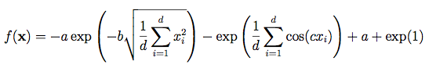

# genetic-algorithm

## parameters
### features (coefficients of funxtion)
features = [[10, 4], [14, 21], [10, 1], [14, 10], [10, 40]]
### function
function = ackley
#### ackley

### num of steps to find min/max
life_time = 1000
### range of coefficients
feature_range = range(-40, 40)
### how much reproduct children 
num_of_children = 100
### How often to do mutation (every 5 steps)
speed_parameter = 5
### sensivity (1 - high, 10..00 - low)
sensivity = 1
### smart_mutation (if true - mutation start if result is stable, if false - mutation start every 'speed_parameter' steps) 

# results 
- features = [[10, 4], [14, 21], [10, 1], [14, 10], [10, 40]]
- life_time = 1000
- feature_range = range(-40, 40)
- num_of_children = 100
- speed_parameter = 5
- function = parabula (y = x^2 - x)
- sensivity = 1
- smart_mutation = False

## find min (y = x^2 - x)

## find max (y = x^2 - x)

## find min (y = ackley)

- features = [[10, 4], [14, 21], [10, 1], [14, 10], [10, 40]]
- life_time = 1000
- feature_range = range(-40, 40)
- num_of_children = 100
- function = ackley
- sensivity = 1
- smart_mutation = True

